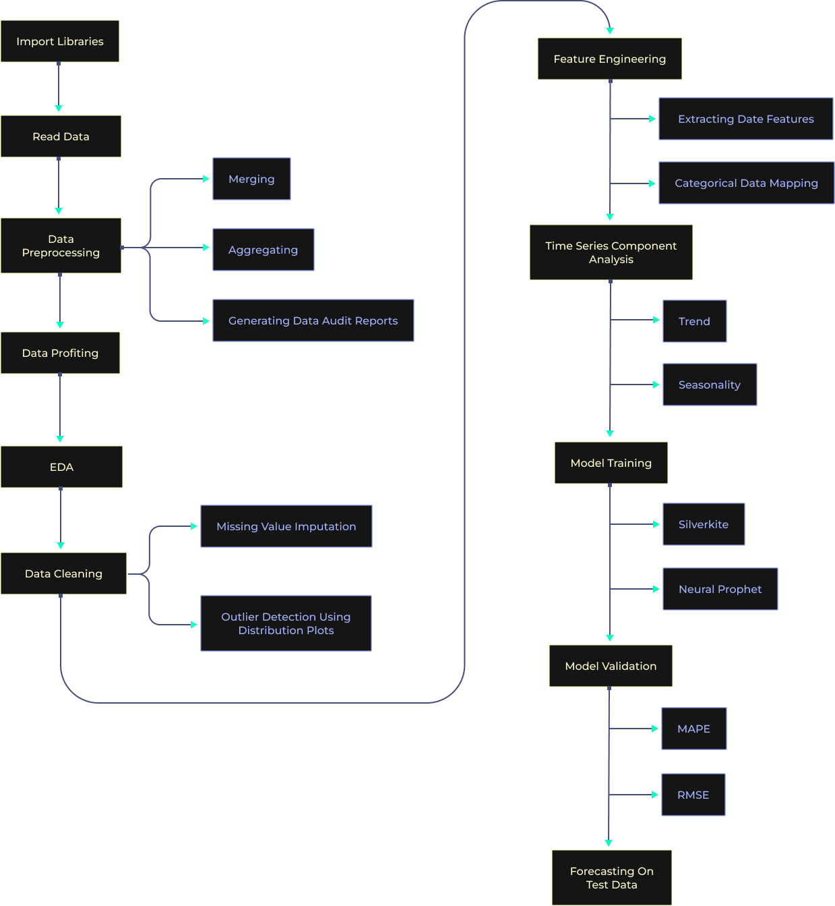

# ML_DemandSales

Prediction of commercial demand/sales using historical data and other related features using Greykite and Neural Prophet
## Aim
To predict future demand/sales using historical data and other related features.
Dataset

## Data Description
The dataset used is Walmart store sales data. Walmart is an American multinational
retail corporation which operates a chain of hypermarkets, department stores and
Grocery stores. The dataset provided is historical sales data for 45 Walmart stores
located in different regions. Each store contains many departments. Four different
datasets are being provided which are discussed below.1. Stores.csv: This file contains information about the 45 stores, indicating the type
and size of store.
* Train.csv: This is the historical training data, which covers 2010-02-05 to
2012-11-01.
* Test.csv: This file is identical to train.csv, except the weekly sales which have to
be predicted.
* Features.csv: This file contains additional data related to the store, department,
and regional activity for the given dates.